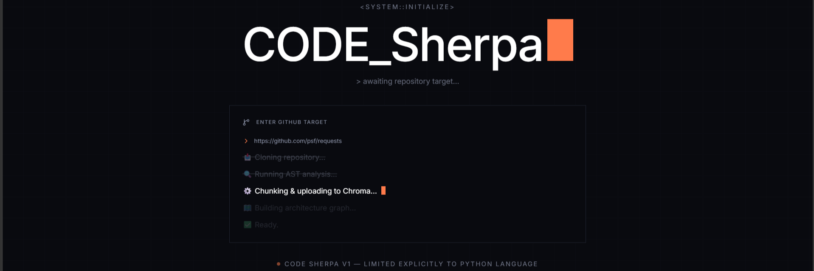
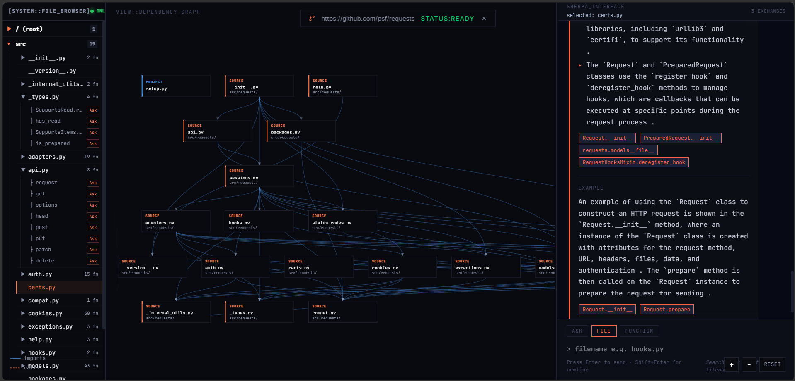

# CODE Sherpa 🏔️

<div align="center">
  
  
  
  
</div>

<br/>

**CODE Sherpa** is a deterministic code understanding engine that helps developers **learn and navigate unfamiliar codebases with confidence — without relying on hallucinating AI.**


Unlike traditional “chat-with-code” tools, CODE Sherpa separates:

- **Structure (AST)** → Ground truth (100% deterministic)  
- **Explanation (LLM)** → Human-readable guidance  

> 🧠 *The AST is the Judge. The AI is the Narrator.*

Every explanation is:
- Traceable to real code  
- Reproducible across runs  
- Grounded in verified structure  

---

---

CODE Sherpa transforms raw repositories into:

- 📊 Interactive architecture graphs  
- 🧭 Guided learning paths  
- 🔍 Graph-aware semantic search  

Powered by a FastAPI backend and a developer-first React telemetry UI, the system is optimized for **deep codebase understanding**, not just surface-level querying.

> ⚠️ Version 01 supports Python repositories only.




## ❗ Why CODE Sherpa?

Understanding existing codebases is one of the hardest problems in software engineering.  
CODE Sherpa solves this by turning code into a structured, guided learning experience.

## ⚙️ Prerequisites

Before you begin, ensure you have the following installed and set up on your machine:

1. **Python 3.8 or higher**
2. **Node.js (LTS recommended) & npm**
3. **Groq API Key:** Required for Large Language Model processing. Grab one from the [Groq Console](https://console.groq.com).
4. **Chroma Cloud Credentials:** API Key, Tenant, Database

---

## 💻 Installation & Setup

### 1. Clone the Repository

```bash
git clone https://github.com/GoLu-Jii/CODE_Sherpa
cd CODE_Sherpa
```

### 2️⃣ Backend Setup (API & Engine)

Set up the Python environment from the project root:

```bash
# Create virtual environment
python -m venv .venv

# Activate environment

# Windows (PowerShell)
.venv\Scripts\Activate.ps1

# macOS/Linux
source .venv/bin/activate

# Install dependencies
pip install -r requirements.txt
```


## Set up your required environment variables:

```bash
GROQ_API_KEY=your_groq_api_key

CHROMA_API_KEY=your_chroma_api_key
CHROMA_TENANT=your_chroma_tenant
CHROMA_DATABASE=your_chroma_database
```

### 🔑 How to Get Chroma Credentials

Follow these steps to obtain your Chroma credentials:

1. Go to [https://www.trychroma.com](https://www.trychroma.com)
2. Create an account and set up a database
3. Navigate to **Settings**
4. Click **Create API & Copy Code**
5. You will receive something like:

```python
api_key='YOUR_API_KEY',
tenant='your_tenant',
database='your_db_name'

# Chroma environment variables
CHROMA_API_KEY=YOUR_API_KEY
CHROMA_TENANT=your_tenant
CHROMA_DATABASE=your_db_name
```


### 3. Frontend Environment

Open a new terminal window, navigate to the frontend directory, and install dependencies:

```bash
cd frontend
npm install
```

Configure your local environment variables:
```bash
cp .env.example .env

# Or manually create 
frontend/.env

# With
VITE_API_BASE_URL=http://localhost:8000

# Ensure VITE_API_BASE_URL is pointing to your local backend (e.g., http://localhost:8000)
```

---

## 🏃‍♂️ Running the System

Start both systems to experience the full CODE Sherpa interface.

### Start the Intelligence Backend

```bash
# Ensure .venv is activated
cd backend
python -m uvicorn app.server:app --reload
```
*The API will be available at: http://localhost:8000*

### Start the Telemetry UI

```bash
cd frontend
npm run dev
```
*The dashboard will be available at: http://localhost:5173*

---

## 🧪 How to Use


1. Start backend and frontend
2. Open http://localhost:5173
3. Paste a GitHub repository URL
4. Click "Ingest"
5. Ask questions like:
   - "How is authentication implemented?"
   - "What does compat.py do?"

You will see:
- Graph visualization
- File relationships
- Grounded explanations


## 📄 License

This project is licensed under the terms of the Apache License. See the [LICENSE](LICENSE) file for more information.
