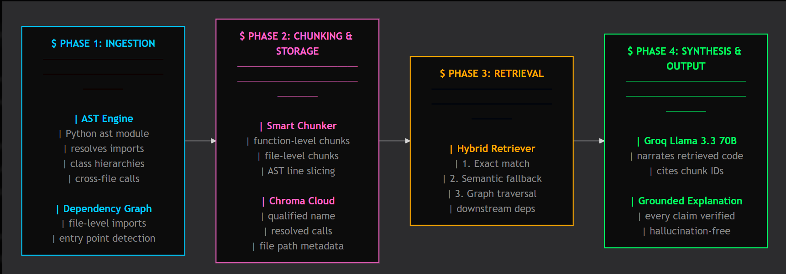

# CODE Sherpa

**A deterministic code understanding engine. The AST is the Judge. The AI is the Narrator.**

[Live Demo](https://code-sherpa-mu.vercel.app/) · Built by [Gaurav Joshi](https://github.com/GoLu-Jii)


---

## The problem

Every "chat with your codebase" tool today works the same way: embed some code, retrieve a few chunks, ask an LLM to explain it. The LLM has no ground truth about the actual structure of the code — it is guessing based on text similarity. Ask it what calls a function, and it will confidently make something up if the retrieval missed the real answer.

CODE Sherpa does not work that way.

## The approach

CODE Sherpa separates two concerns that every other tool conflates:

- **Structure** comes from a real Python AST parser. Every function, class, import, and call relationship is extracted deterministically — no guessing, no embeddings deciding what "structure" means.
- **Explanation** comes from an LLM (Groq, Llama 3.3 70B) that is only ever shown real code chunks the AST engine already verified exist.

The AST is the source of truth. The LLM only narrates what the AST already proved. Every claim in every response is cited back to a specific function or file — click the citation, see the real code.

## How it's different

| | Typical chat-with-code tools | CODE Sherpa |
|---|---|---|
| Retrieval | Pure embedding similarity | Exact AST symbol match → semantic fallback → graph traversal |
| Citations | Often absent or wrong | Every claim traces to a real function or file node |
| Dependency mapping | Not available or approximate | Built from actual import resolution and call graph analysis |
| Cross-file calls | Rarely resolved correctly | Resolved via attribute-chain tracking and instance type inference |

## What it looks like


The left panel is a live file browser generated from the AST — folders, files, and every function inside them. The center panel is the dependency graph, built entirely from resolved import relationships, not a static diagram. The right panel is the chat — every response cites the exact function or file it came from, and clicking a citation jumps you straight to that code.

## Architecture



## Tech stack

**Backend:** FastAPI, Python `ast` module for static analysis, Chroma Cloud for vector storage, Groq for LLM inference.

**Frontend:** React, Vite, a custom dependency graph renderer built without a heavyweight graph library, JetBrains Mono throughout for a terminal-grade reading experience.

**Why these choices:** FastAPI over Flask for native async support, since ingestion (clone + parse + embed) runs as a background job with status polling rather than blocking the request. Chroma Cloud over a self-hosted vector DB to avoid managing infrastructure for what is currently a single-tenant tool. Groq over OpenAI for inference speed — Llama 3.3 70B on Groq returns in well under a second, which matters when every response needs to wait on a retrieval step first.

## Key engineering decisions

**Cross-file call resolution without a full type system.** Python has no static types by default, so resolving `self.adapter.send()` to the actual function it calls requires tracking what `self.adapter` was assigned to earlier in the function. The AST engine does this with a lightweight instance-type tracker that follows variable assignments through the function body — not a full type inference engine, but enough to resolve the majority of real-world call chains correctly.

**Hybrid retrieval instead of pure RAG.** Pure embedding retrieval fails on exact lookups — ask "what does `hooks.py` do" and a vector search might return a semantically similar but wrong file. CODE Sherpa checks for exact file and symbol matches first, using AST-derived metadata, and only falls back to embeddings when there is no deterministic match. This is the difference between a tool that retrieves "probably relevant" code and one that retrieves "we know for certain this is what you asked about."

**Background job processing for ingestion.** Cloning a repository and running full AST analysis can take well over the request timeout window on most hosting platforms. Ingestion runs as a background task with a polling status endpoint, so the frontend can show live progress (cloning → analyzing → uploading → charting) instead of a blocking spinner.

## Try it

[code-sherpa-mu.vercel.app](https://code-sherpa-mu.vercel.app/)

Paste any public GitHub repository URL containing Python code. Note: version 1 is scoped to Python only.

## Local setup

<details>
<summary>Expand for installation instructions</summary>

### Requirements

- Python 3.8+
- Node.js (LTS) & npm
- A [Groq API key](https://console.groq.com)
- [Chroma Cloud](https://www.trychroma.com) credentials (API key, tenant, database)

### Backend

```bash
git clone https://github.com/GoLu-Jii/CODE_Sherpa
cd CODE_Sherpa
python -m venv .venv
source .venv/bin/activate   # Windows: .venv\Scripts\Activate.ps1
pip install -r requirements.txt
```

Create a `.env` file:

```
GROQ_API_KEY=your_groq_api_key
CHROMA_API_KEY=your_chroma_api_key
CHROMA_TENANT=your_chroma_tenant
CHROMA_DATABASE=your_chroma_database
```

```bash
cd backend
python -m uvicorn app.server:app --reload
```

Backend runs at `http://localhost:8000`.

### Frontend

```bash
cd frontend
npm install
cp .env.example .env   # set VITE_API_BASE_URL=http://localhost:8000
npm run dev
```

Frontend runs at `http://localhost:5173`.

</details>

## Roadmap

- Multi-language support beyond Python
- Per-session isolated vector collections for concurrent users
- Call-chain tracing between any two functions in a codebase

## License

Apache License. See [LICENSE](LICENSE).